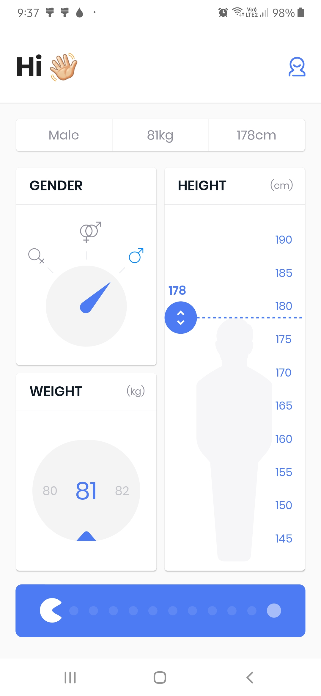
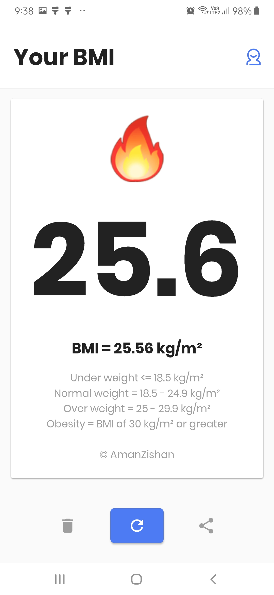

## A flutter project that calculates BMI of a person.

  
  

[click here to download APK](https://github.com/Aman-zishan/BMI-App/raw/master/BMI%20app.apk)

reference:https://fidev.io/bmi-calculator/
